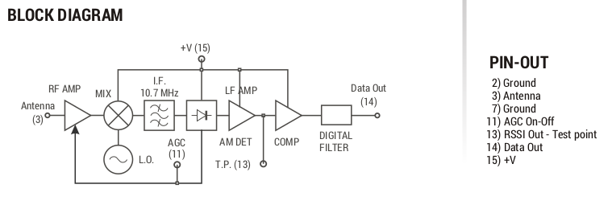
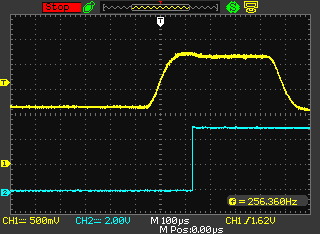
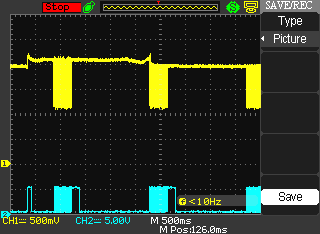

# UHFIsmFoxHunt
Fox Hunt Devices on UHF ISM Band

## Hardware
### Tape Measure Antenna
The idea is to use tape measure Yagi antennas. These are, as the name implies, made from flexible metal ribbon that can bend without breaking or being permanent deformed. Ideal for less careful use and making your way through field and forest.

Getting the dimensions right is easy when using an online calculator.
- [3 element Yagi](https://www.basictables.com/amateur-radio/antenna/three-element-yagi-antenna)
- [4 element Yagi](https://www.basictables.com/amateur-radio/antenna/seven-element-yagi-antenna)

Below you see a first prototype (made by ON5YT) with which a first QSO from over 20km (5W protable) was made. Looks promising. Further testing must tell us what the directionalty (-3dB angle) of this antenna is and thereby how good it will perform in locating the 'fox'.

### Transmitter/Receiver
#### HopeRF RFM85 (transmitter)

This small transmitter sends AM on 433.92MHz. It only has 3 connections (Power, Ground and Data). This device is meant to transmit digital data. It does this by simply sending the AM carrier when there's a 'H' on the 'Data' pin. Else the transmitter is silent. The transmitter is nothing more than an oscillator that's 'ON' when data-signal is 'H' and 'OFF' with a 'L' level.

[Datasheet](./Datasheets/K1180946924.pdf)

#### Aurel RX-4MM5-F (receiver)

This receiver exposes 2 extra pins. The 'AGC' pin can be used to put the receiver in it's high sensitivity mode. This is perhaps usable to listen if a fox is active. The second pin is the 'RSSI'. This gives an analog voltage indicating the received RF signal strength.
A simple first test already showed that this RSSI signal might be usable. There was a clear difference on this signal when the antenna on the receiver was removed. Combining this with a Yagi antenna adds directionality.

This receiver is build around the following components:
- [MAX1473](./Datasheets/MAX1473.pdf)
- [LM393](./Datasheets/lm393.pdf)

**Block Diagram**

The Digital output is not stable when a continuous AM signal was sent. This digital output clearly expects a switching AM signal.

## 'RSSI' and Digital output
The digital and RSSI signal output look similar. This is not surprising when we look at the receiver diagram. The RSSI signal (Yellow) is the signal after the AM detector and before the comparator. The ´Data' (Cyan) output is after this comparator.

### RSSI and signal strength
- [RSSI Wiki article](https://en.wikipedia.org/wiki/Received_signal_strength_indicator)

The 'RSSI' signal as the receiver documentation call it, is nothing more than the signal after the AM peak detector. It's not strictly what the RSSI actual is, but it suffices for our use-case. 

The image below shows the effect on the RSSI-signal (Yellow) __with__ antenna (left side) and __without__. (Removing the antenna on the receiver was the fastest and easiest method to demonstrate the effect on the signal). 

### Digital Signals
#### Serial data
Transmitting serial (RS232) data doesn´t work. It's not received correctly. The image above that shows the 'RSSI' and digital output already shows that the signal timing is altered due to the receiver hardware. Messing with the bit timing RS232 (Serial data) depends on.

#### ASK/OOK
The transmitter and receiver are both designed to use ASK ([Amplitude Shift Keying](https://en.wikipedia.org/wiki/Amplitude-shift_keying)) for data transmission. 

ASK encodes different 'tokens' into different Amplitudes. A more extreme version (but encodes less bits/token) is On-Off-Keying (OOK). With OOK there either __IS__ an AM signal or there __ISN'T__. This looks very similar to Morse Code (or [CW](https://en.wikipedia.org/wiki/Carrier_wave)).

#### Software
For Arduino there's the following [library](https://github.com/Haven-Lau/Arduino-Libraries/blob/master/RadioHead/RH_ASK.cpp) that encodes and decodes data into ASK compatible patterns. And transmitting the data bytes that way.

Some similar projects:
- [Raspberry Pico](https://github.com/AdrianCX/pico433mhz)
- [ASK/OOK protocol explanation](https://www.youtube.com/watch?v=w6V9NyXwohI)
- [Analog Devices Hardware](https://www.analog.com/en/resources/technical-articles/im-ook-youre-ook.html)
