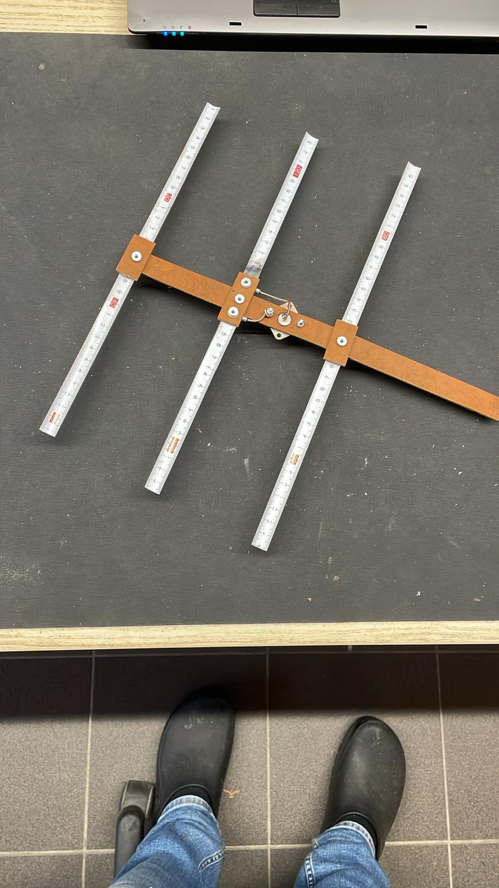
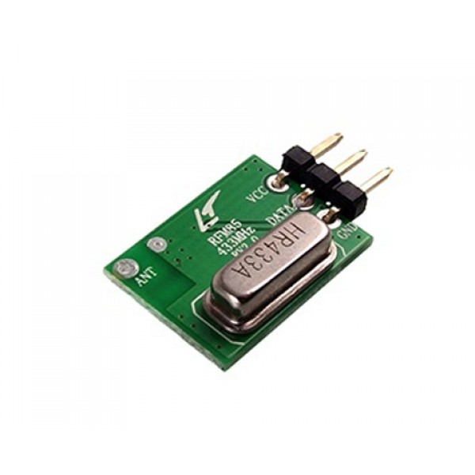

# UHFIsmFoxHunt
Fox Hunt Devices on UHF ISM Band

## Hardware
### Tape Measure Antenna
The idea is to use tape measure Yagi antennas. These are, as the name implies, made from flexible metal ribbon that can bend without breaking or being permanent deformed. Ideal for less careful use and making your way through field and forest.

Getting the dimensions right is easy when using an online calculator.
- [3 element Yagi](https://www.basictables.com/amateur-radio/antenna/three-element-yagi-antenna)
- [4 element Yagi](https://www.basictables.com/amateur-radio/antenna/seven-element-yagi-antenna)

Below you see a first prototype (made by ON5YT) with which a first QSO from over 20km (5W protable) was made. Looks promising. Further testing must tell us what the directionalty (-3dB angle) of this antenna is and thereby how good it will perform in locating the 'fox'.

### Transmitter/Receiver
#### HopeRF RFM85

This small transmitter sends AM on 433.92MHz. It only has 3 connections (Power, Ground and Data). This device is meant to transmit digital data. It does this by simply sending the AM carrier when there's a 'H' on the 'Data' pin. Else the transmitter is silent.

#### Aurel RX-4MM5-F

This receiver exposes 2 extra pins. The 'AGC' pin can be used to put the receiver in it's high sensitivity mode. This is perhaps usable to listen if a fox is active. The second pin is the 'RSSI'. This gives an analog voltage indicating the received RF signal strength.
A simple first test already showed that this RSSI signal might be usable. There was a clear difference on this signal when the antenna on the receiver was removed. Combining this with a Yagi antenna add directionality.

The Digital output is not stable when a continuous AM signal was sent. This digital output clearly expects a switching AM signal.
